# Stickman Fighter Online

A high-performance, real-time 2D fighting game featuring supernatural powers, advanced combo mechanics, and P2P multiplayer. Built with React, TypeScript, Canvas API, and PeerJS for cross-platform, peer-to-peer online gameplay.

---

## Table of Contents

1. [Project Overview](#project-overview)
2. [Core Features](#core-features)
3. [Architecture](#architecture)
4. [System Requirements](#system-requirements)
5. [Installation & Setup](#installation--setup)
6. [Quick Start Guide](#quick-start-guide)
7. [Controls & Gameplay](#controls--gameplay)
8. [Advanced Mechanics](#advanced-mechanics)
9. [Development](#development)
10. [Configuration](#configuration)
11. [Troubleshooting](#troubleshooting)
12. [Contributing](#contributing)
13. [License](#license)

---

## Project Overview

**Stickman Fighter Online** is a browser-based, 1v1 real-time fighting game delivering arcade-style combat with modern game design principles. Players engage in best-of-3 matches with fully synced P2P gameplay over WebRTC, requiring no server backend.

### Key Highlights

- **🌐 True Peer-to-Peer**: Uses PeerJS for serverless multiplayer (scales infinitely)
- **⚡ AAA Gamification**: Style meter, combo scaling, rage mode, guard breaks, health regen
- **📱 Cross-Platform**: Desktop (keyboard) and mobile (touch controls) with auto-detection
- **🎨 Procedural Visuals**: Canvas-rendered animations, particle effects, dynamically shaking screen
- **💪 Supernatural Powers**: Fireballs, lightning, teleportation, devastating super attacks
- **🎯 Skill-Based Balance**: Damage scales with combo hits, attack variety, defense mechanics

---

## Core Features

### 1. Combat System

**Attack Types** (11 distinct moves):
| Move | Energy | Damage | Range | Purpose |
|------|--------|--------|-------|---------|
| Punch (J) | 3 | 5 | 60px | Fast, safe opener |
| Kick (K) | 5 | 7 | 75px | Extended range |
| Uppercut (U) | 10 | 10 | 65px | Launches opponent |
| Fireball (I) | 18 | 8 | Ranged | Mid-range poke |
| Lightning (O) | 25 | 12 | Ranged | High damage, stun |
| Teleport (Shift) | 15 | 0 | Utility | Gap close, escape |
| Super (Space) | Requires full super bar | 20 | Ranged | Devastating finishing move |

**Core Mechanics**:
- **Block (L)**: Reduces damage by 80%, generates 4 energy per hit blocked
- **Crouch (S)**: Immune to high attacks, enables ground combos
- **Jumping (W)**: Aerial combos, escape pressure
- **Chip Damage**: 10% of attack damage bleeds through block

### 2. AAA Gamification Systems

#### Style Meter (Damage Multiplier)
```
Meter Range: 0-100
Rank Progression: D → C → B → A → S
Damage Bonus: 0% → 5% → 12% → 20% → 30%
```

**Building Style**:
- +8 per successful hit
- +12 bonus for attacks different from last attack (promotes variety)
- Meter caps at 100
- Decays -0.3 per frame after inactivity window

**Strategic Depth**: Players must vary attacks to maximize style bonus and damage output

#### Combo System (Scaling)
```
Combo Multiplier Formula: 0.85^(hit_number - 1)

Hit 1: 1.0x
Hit 2: 0.85x
Hit 3: 0.72x
Hit 4: 0.61x
Hit N: 0.85^(N-1)
```

**Combo Window**: 50 frames (~833ms) between hits to maintain combo

**Announcements**:
- 3x Combo: "3x COMBO!" (Green)
- 5x Combo: "5x BRUTAL!" (Purple)
- 8x Combo: "8x INSANE!" (Orange)
- 12x+ Combo: "Nx GODLIKE!!" (Red)

**Longest Combo Tracking**: Persists across rounds, displayed in match stats

#### Rage Mode (Low Health Activation)
```
Activation Threshold: HP <= 25% of max
Duration: 5 seconds (300 frames)
```

**Rage Effects**:
- **Attack Bonus**: +30% damage multiplier
- **Defense Bonus**: -30% incoming damage multiplier
- **Energy Regen**: Doubles from 0.25 → 0.5 per frame
- **Visual**: Red aura, rage particles, enhanced glow
- **Psychological**: Opponents must respect the threat level

**Strategic Application**: Last-stand comeback mechanic

#### Poise System (Guard Health)
```
Max Poise: 100
Damage per Hit: -18 (normal), -8 (blocked)
Regeneration: 1 frame delay, then +0.8/frame after 60 frames
```

**Guard Break Mechanics**:
- When `poise <= 0`: Fighter enters stunned `poiseBreak` state
- Stun Duration: 60 frames (1 second)
- Blocking disabled during stun
- No actions possible during stun
- Recovery: Poise must regenerate to 50% to recover from broken state

**Strategic Depth**: Separate guard health prevents infinite blocking

#### Health Regeneration
```
Activation: After 2 seconds without damage
Rate: +0.08 HP/frame (48 HP/sec when active)
```

**Regen Mechanics**:
- Any damage resets 2-second timer
- Regen disabled when health <= 0 (KO)
- Cannot exceed max health

### 3. Supernatural Powers

**Energy System**:
- Max Energy: 100
- Passive Regen: 0.25/frame (normal), 0.5/frame (rage mode)
- Energy Block: +4 per blocked hit
- Energy Costs: See table in section 1

**Power Mechanics**:

**Fireball**: 
- Cast time: 25 frames
- Projectile lifetime: 90 frames
- Speed: 7 px/frame
- Trajectory: Straight horizontal line
- Particle trail: Fire effect

**Lightning**:
- Cast time: 35 frames
- Range: Reaches opponent's center ±40px perturbation
- 13 segment path with jagged effect
- Auto-targets opponent at cast time
- Screen effects: Shake + flash + particles
- Damage: 12 (highest non-super damage)

**Teleport**:
- Instant (12-frame cooldown animation)
- Destination: Opponent position + 80px in facing direction
- Leaves trail particles at departure point
- Cancels hitstun (useful for escape)
- Energy Cost: 15 (mid-range cost)

**Super Attack**:
- Requirement: Full super bar (100/100)
- Charge Rate: +12 per offensive hit, +15 per hit taken
- Charge Rate (rage mode): Same, but during rage only +12 from blocks becomes +15
- Cast time: 60 frames
- Projectile: Golden beam, larger radius (30px)
- Effects: Maximum screen shake (18), flash, slowmo (10 frames)

### 4. Round & Match Structure

**Round Mechanics**:
- Timer: 90 seconds per round
- Win Conditions:
  - Opponent health reaches 0
  - Timer expires (higher HP wins)
- Countdown: 3-second countdown before fighting starts
- Round End: 3-second stats screen before next round

**Match Structure**:
- Format: Best of 3 rounds (first to 2 wins)
- Max Rounds: 3
- Perfect Round Bonus: If winner maintains 100% HP, bonus announcement
- Match Stats: Aggregate damage, combos, accuracy, style ranks

**Statistics Tracking**:
- Total damage dealt
- Total damage taken
- Longest combo
- Total hits vs total attacks (accuracy)
- Perfect round indicator
- Rage activations
- Guard breaks
- Super attacks landed
- Final style rank

---

## Architecture

### High-Level System Design

```
┌─────────────────────────────────────────────────────────────────┐
│                       USER INTERFACE LAYER                       │
│  ┌──────────────┐  ┌──────────────┐  ┌──────────────┐           │
│  │ App.tsx      │  │ Lobby.tsx    │  │ GameCanvas   │           │
│  │ (Screen Mgr) │  │ (Room Setup) │  │ (Game Loop)  │           │
│  └───────┬──────┘  └──────────────┘  └──────────────┘           │
│          │                                      │                │
└──────────┼──────────────────────────────────────┼────────────────┘
           │                                      │
┌──────────┼──────────────────────────────────────┼────────────────┐
│ INPUT L  │    CONTROL LAYER                     │                │
│ ┌────────▼────────┐         ┌──────────────┐   │                │
│ │ TouchControls   │         │ Keyboard/Touch   │                │
│ │ (Mobile HUD)    │         │ Event Handlers   │                │
│ └─────────────────┘         └────────────────┘ │                │
└──────────────────────────────────────────────────────────────────┘
                              │
                              ▼ buildInput()
┌──────────────────────────────────────────────────────────────────┐
│ GAME ENGINE LAYER                                                │
│ ┌────────────────────────────────────────────────────────────────┤
│ │ engine.ts: updateGame(state, inputs...) → newState            │
│ │ ├─ Input Processing & Priority                                │
│ │ ├─ Combat Resolution (Melee, Projectiles, Lightning)          │
│ │ ├─ Damage Calculation (Combos, Style, Rage, Block)            │
│ │ ├─ AAA Systems (Poise, Rage, Regen, Style)                   │
│ │ ├─ Physics (Gravity, Collision, Arena Boundaries)             │
│ │ ├─ Particle & Effect Updates                                   │
│ │ └─ Game Phase Management (Countdown/Fighting/RoundEnd/GameOver)│
│ └────────────────────────────────────────────────────────────────┤
│ ┌────────────────────────────────────────────────────────────────┤
│ │ types.ts: GameState, Fighter, Projectile, etc.               │
│ │ constants.ts: Balance parameters, timings, costs              │
│ └────────────────────────────────────────────────────────────────┘
└──────────────────────────────────────────────────────────────────┘
                              │
                              ▼ GameState
┌──────────────────────────────────────────────────────────────────┐
│ NETWORKING LAYER                                                 │
│ ┌────────────────────────────────────────────────────────────────┤
│ │ network.ts: NetworkManager                                     │
│ │ ├─ Room Creation/Joining (codes, PeerJS)                       │
│ │ ├─ P2P Connection Management                                   │
│ │ ├─ Message Protocol (Input, State, Ping, Ready, Rematch)      │
│ │ ├─ Latency Monitoring                                          │
│ │ └─ Connection Lifecycle Handlers                               │
│ └────────────────────────────────────────────────────────────────┘
│ * Uses WebRTC via PeerJS for low-latency communication          │
│ * Host authoritative model: Host broadcasts state every 3 frames│
│ * Guest predicts locally, corrects on state receive             │
└──────────────────────────────────────────────────────────────────┘
                              │
                              ▼ Canvas Context
┌──────────────────────────────────────────────────────────────────┐
│ RENDERING LAYER                                                  │
│ ┌────────────────────────────────────────────────────────────────┤
│ │ renderer.ts: Canvas 2D Rendering                              │
│ │ ├─ Background (Parallax, Stars, Moon, Fog, Runes)             │
│ │ ├─ Stickman Drawing (11 animation poses)                      │
│ │ ├─ Aura & Glow Effects                                        │
│ │ ├─ Projectiles & Lightning Bolts                              │
│ │ ├─ Particles & Damage Text                                    │
│ │ ├─ UI Bars (Health, Energy, Super, Poise)                     │
│ │ ├─ Combat Info (Combo, Style Rank)                            │
│ │ └─ Phase Overlays (Countdown, RoundEnd, GameOver)             │
│ └────────────────────────────────────────────────────────────────┘
│ * 1024x576 canvas rendered at 60 FPS                            │
│ * Responsive scaling for mobile/desktop                         │
│ * Screen shake, flash, slowmo effects                           │
└──────────────────────────────────────────────────────────────────┘
                              │
                              ▼ Visual Output
                      ┌───────────────────┐
                      │  Player's Screen  │
                      │  (React mounted)  │
                      └───────────────────┘
```

### Mermaid Architecture Diagram

```mermaid
graph TD
    A["App.tsx<br/>(Screen Management)"] --> B["Lobby"]
    A --> C["GameCanvas"]
    
    C --> D["Input Layer"]
    D --> E["Keyboard Events"]
    D --> F["TouchControls"]
    
    C --> G["Game Engine<br/>engine.ts"]
    G --> H["Combat Resolution"]
    G --> I["AAA Systems<br/>Style/Combo/Rage/Poise"]
    G --> J["Physics & Particles"]
    
    C --> K["Network Manager<br/>network.ts"]
    K --> L["P2P Connection<br/>PeerJS"]
    K --> M["Message Protocol<br/>Input/State/Ping"]
    
    G --> N["Game State<br/>types.ts"]
    N --> O["Renderer<br/>renderer.ts"]
    
    O --> P["Canvas Output<br/>1024x576 @ 60FPS"]
    P --> Q["Browser Display"]
    
    F -.-> D
    E -.-> D
    D -.-> G
    
    style A fill:#4a90e2
    style C fill:#7b68ee
    style G fill:#ff6b6b
    style K fill:#51cf66
    style O fill:#ffa500
    style Q fill:#333
```



### Data Flow Diagram

```
Current Frame N:

Player Input (60Hz)
   └─> buildInput() [local + touch merged]
       └─> { left, right, jump, punch, ... seq }

Send to Network (30Hz throttled)
   └─> network.send({ type: 'input', input })
       └─> PeerJS DataChannel
           └─> Opponent receives

Game Loop (60Hz)
   ├─> Receive remote input from opponent
   ├─> Execute updateGame(state, p1Input, p2Input)
   │   ├─ applyInput(p1, p1Input) [local player]
   │   ├─ applyInput(p2, p2Input) [remote player]
   │   ├─ checkMelee(p1, p2) & checkMelee(p2, p1)
   │   ├─ updateProjs(state)
   │   ├─ updateBolts(state)
   │   ├─ updateRage(p1) & updateRage(p2)
   │   ├─ updatePoise(p1) & updatePoise(p2)
   │   ├─ updateRegen(p1) & updateRegen(p2)
   │   └─ decayStyle(p1) & decayStyle(p2)
   │
   ├─> Send state to peer (20Hz every 3 frames) [Host only]
   │   └─> network.send({ type: 'state', state })
   │
   └─> Render Frame
       └─> drawBackground(ctx, frame)
       └─> drawStickman(ctx, p1)
       └─> drawStickman(ctx, p2)
       └─> drawProjectiles(ctx, projectiles)
       └─> drawUI(ctx, state)
       └─> requestAnimationFrame(loop)

Latency Measurement (every 2 seconds)
   ├─> network.send({ type: 'ping', t: now })
   └─> Receive { type: 'pong', t }
       └─> latency = (now - t) / 2
```

---

## System Requirements

### Browser Compatibility

| Feature | Chrome | Firefox | Safari | Edge | Mobile |
|---------|--------|---------|--------|------|--------|
| WebRTC (PeerJS) | ✅ 30+ | ✅ 24+ | ✅ 11+ | ✅ 12+ | ✅ |
| Canvas 2D | ✅ | ✅ | ✅ | ✅ | ✅ |
| Fullscreen API | ✅ | ✅ | ✅ | ✅ | ✅ (mobile) |
| Touch Events | ✅ | ✅ | ✅ | ✅ | ✅ |
| Web Workers | ✅ | ✅ | ✅ | ✅ | ✅ |

### Hardware Requirements

**Desktop (Minimum)**:
- CPU: 1GHz+ dual-core processor
- RAM: 512 MB
- Network: 1 Mbps upload/download
- Browser: Modern (Chrome 60+, Firefox 55+, Safari 11+)

**Mobile (Minimum)**:
- iOS: iPhone 6+ or newer (iOS 11+)
- Android: Android 5.0+ (modern browser)
- RAM: 2GB+
- Network: 3G+ (LTE recommended)
- Screen: 4.7" minimum (landscape play)

### Network Requirements

**Bandwidth**:
- Input transmission: ~1 KB/message @ 30Hz = ~30 KB/min = 0.5 KB/sec
- State transmission: ~20 KB/message @ 20Hz = ~27 MB/hour (only on host)
- Combined per player: ~0.5-1 KB/sec upstream, 1-2 KB/sec downstream

**Latency**:
- Playable: < 200ms
- Optimal: < 100ms
- Minimum (for arcade feel): < 50ms

**NAT Traversal**: STUN servers configured; works with most residential NAT/firewall

---

## Installation & Setup

### Prerequisites

- **Node.js**: v16.0.0 or higher
- **npm**: v7.0.0 or higher
- **Git**: For cloning repository

### Step 1: Clone Repository

```bash
git clone https://github.com/yourusername/stickman-fighter-online.git
cd stickman-fighter-online
```

### Step 2: Install Dependencies

```bash
npm install
```

**Dependencies Installed**:
```json
{
  "react": "19.2.3",
  "react-dom": "19.2.3",
  "peerjs": "^1.5.5",
  "clsx": "2.1.1",
  "tailwind-merge": "3.4.0",
  "tailwindcss": "4.1.17",
  "@tailwindcss/vite": "4.1.17",
  "typescript": "5.9.3",
  "vite": "7.3.2"
}
```

### Step 3: Environment Configuration

Create `.env.local` (optional):
```env
# Optional: Override STUN servers
VITE_STUN_SERVER_1=stun:stun.l.google.com:19302
VITE_STUN_SERVER_2=stun:stun1.l.google.com:19302

# Optional: PeerJS production key
VITE_PEERJS_KEY=your-key-here
```

### Step 4: Start Development Server

```bash
npm run dev
```

Server will start at `http://localhost:5173`

### Step 5: Build for Production

```bash
npm run build
```

Output: `dist/` folder with minified production files

### Step 6: Deploy

**Option A: Static Hosting (Recommended)**
```bash
# Deploy dist folder to Netlify, Vercel, GitHub Pages, etc.
# Example (Netlify):
npm install -g netlify-cli
netlify deploy --prod --dir=dist
```

**Option B: Docker (Optional)**
```dockerfile
FROM node:18-alpine
WORKDIR /app
COPY package*.json ./
RUN npm ci --only=production
COPY . .
RUN npm run build
EXPOSE 3000
CMD ["npm", "run", "preview"]
```

**Option C: Local Testing (HTTPS required for WebRTC)**
```bash
# For testing with peers, use HTTPS
npm run dev -- --https
# Or use ngrok for tunneling
ngrok http 5173
```

---

## Quick Start Guide

### Starting Your First Game

**Step 1: Open Two Browser Tabs**
- Tab 1: `http://localhost:5173` (Host player)
- Tab 2: `http://localhost:5173` (Guest player)

**Step 2: Enter Your Name**
- Tab 1: Type name, click "🏟 Create Room"
- Copy the 5-character room code displayed

**Step 3: Join Game**
- Tab 2: Type name, click "🎮 Join Room"
- Paste room code, click "Join"
- Wait for both players to connect

**Step 4: Game Starts**
- 3-second countdown appears
- Both players have equal footing
- Victory in best of 3 rounds

### First Time Playing

1. **Read the Tutorial**: Click "?" button in top right
   - Covers basic movement, attacks, powers
   - Step-by-step animated demonstrations

2. **Practice against AI Friend** (Future feature)
   - Single-player training mode (not yet implemented)

3. **Play Online**
   - Find a friend with room code
   - Keep room code sharing simple (copy/paste)

---

## Controls & Gameplay

### Desktop Keyboard Controls

#### Movement & Jumping

| Action | Key | Alternative |
|--------|-----|-------------|
| Move Left | **A** | ← Arrow |
| Move Right | **D** | → Arrow |
| Jump | **W** | ↑ Arrow |
| Crouch | **S** | ↓ Arrow |

#### Basic Attacks

| Action | Key | Damage | Range |
|--------|-----|--------|-------|
| Punch | **J** | 5 | 60px |
| Kick | **K** | 7 | 75px |
| Uppercut | **U** | 10 | 65px |

#### Special Moves

| Action | Key | Energy Cost | Damage |
|--------|-----|-------------|--------|
| Block | **L** | 0 | N/A |
| Fireball | **I** | 18 | 8 |
| Lightning | **O** | 25 | 12 |
| Teleport | **Shift** | 15 | 0 |
| Super Attack | **Space** | Full bar | 20 |

#### General

| Action | Key |
|--------|-----|
| Fullscreen | **F** (or button) |
| Tutorial | **?** (button) |
| Leave Game | **Back** button |
| Rematch | **Enter** (at game over) |

### Mobile Touch Controls

#### Joystick (Left Side)
- **Drag up**: Jump
- **Drag down**: Crouch
- **Drag left**: Move left
- **Drag right**: Move right
- **Release**: Neutral stance

#### Action Buttons (Right Side)

**Standard Buttons**:
- **Punch** (Blue): Fast safe attack
- **Kick** (Orange): Extended range
- **Uppercut** (Purple): Launches opponent
- **Block** (Cyan): Defensive stance
- **Special** (Gold, Large): Super attack when charged

**Power Buttons** (Triangle formation):
- **Fireball** (🔥): Mid-range projectile
- **Lightning** (⚡): High damage area stun
- **Teleport** (👻): Gap close/escape

#### Touch Behavior

**Hold vs Tap**:
- Most buttons respond to **touch down** (press)
- **Touch up** automatically releases action
- Block can be held continuously
- Crouch/Jump maintained while touch held

**Multi-Touch**:
- Can press multiple buttons simultaneously
- Joystick + button inputs work together
- No limit on concurrent inputs

### Gameplay Flow

#### Pre-Match

1. **Lobby Screen**
   - Enter player name (1-15 characters)
   - Either create or join room
   - Wait for opponent connection

2. **Connection Status**
   - "Connecting..." while establishing P2P
   - "Connected" when peer found
   - Auto-starts when both ready

#### Match Start

1. **3-Second Countdown**
   - Both players see "3... 2... 1... FIGHT!"
   - No attacks possible during countdown
   - Platform-specific animations

2. **Round Fighting (90 seconds)**
   - Exchange attacks, build combos
   - Monitor energy (regenerates)
   - Build super charge (full bar = super ready)

3. **Round End**
   - Displaying winner and stats
   - Show longest combo, damage dealt, style rank
   - 3-second pause before next round

4. **Match End**
   - First to 2 wins (best of 3 rounds)
   - Final stats aggregated across all rounds
   - Press **Enter** to rematch, or back to lobby

### Win Conditions

1. **Opponent KO**: Reduce health to 0
2. **Time Out**: If time expires, higher HP wins
3. **Surrender**: Not implemented (intentionally)

---

## Advanced Mechanics

### Combo Mastery

**Building Long Combos**:
1. Hit with attack (any type)
2. Within 50-frame window, land another hit
3. Combo counter increments
4. Each hit does 85% damage of previous (diminishing returns)

**Combo Scaling Example**:
```
Hit 1: 5 damage (100% of punch)
Hit 2: 4 damage (85% of previous)
Hit 3: 3 damage (85% of previous)
Hit 4: 3 damage
...
```

**Announcements by Combo Count**:
- 3x: "3x COMBO!" (Green) - Basic combo established
- 5x: "5x BRUTAL!" (Purple) - Serious pressure
- 8x: "8x INSANE!" (Orange) - Very skilled play
- 12x+: "Nx GODLIKE!!" (Red) - Match-determining combo

**Strategic Application**:
- Vary attack types for style bonus during combos
- Mix in block damage to keep opponent pressured
- Watch for poise break to extend combos indefinitely

### Style System Deep Dive

**Meter Building**:
```
Base gain per hit: +8
Variety bonus (different attack type): +12
Total max gain per diverse hit: +20
```

**Example Combo with Variety**:
- Hit with punch: style +8
- Hit with kick (different): style +8 +12 = +20
- Hit with uppercut (different): style +8 +12 = +20
- Hit with punch (same as 1st, but not consecutive): style +8 +12 = +20
- Total: 68 style meter from 4 hits

**Rank Mechanics**:
```
D: 0-19 style    → 0% damage bonus
C: 20-39 style   → 5% damage bonus
B: 40-64 style   → 12% damage bonus
A: 65-84 style   → 20% damage bonus
S: 85-100 style  → 30% damage bonus (max rank)
```

**Decay**:
- Meter decays -0.3 per frame after inactivity window
- 2-second inactivity resets decay counter
- Continuous hitting prevents decay

**Achieving S-Rank**:
- Requires 85+ style meter
- Need 5+ diverse hits in succession
- Rewards aggressive, varied gameplay
- Master players maintain S-rank consistently

### Rage Mode Strategy

**Activation**:
- Triggers automatically when health ≤ 25% max HP
- Visual: Red aura, special particles, announcement

**Advantages in Rage**:
- +30% outgoing damage (all attacks hit harder)
- -30% incoming damage (take less damage)
- 2x energy regeneration (more power moves available)

**Tactical Use**:
1. **Comeback Attempt**: Use rage to burst down opponent
2. **Extend Fights**: When at low HP, rage extends survivability
3. **Mind Games**: Opponent must respect low-health aggression

**Counter Strategy**:
- While opponent in rage: Play defensive, wait out timer
- Rage duration: 5 seconds (300 frames)
- After rage ends, opponent reverts to normal stats
- Exploit the post-rage vulnerability window

### Guard Break (Poise) Mastery

**Guard Mechanic**:
- Fighter has hidden "poise" meter (100 HP)
- Each hit (even blocked) damages poise by -18 (normal) or -8 (blocked)
- When poise = 0 → Guard break, 1-second stun

**Breaking Guard**:
1. Land 6+ hits on blocking opponent (18*6 = 108 poise damage)
2. Or 13+ blocked hits (8*13 = 104 poise damage)
3. Guard shatters: Opponent stunned for 60 frames
4. During stun, opponent can't block or move

**Guard Regeneration**:
- Poise regenerates +0.8/frame after 1-second delay
- Recovery window: ~75 frames to fully heal
- Recovery to 50%: Clears broken state, re-enables blocking

**Advanced Tactics**:
- **Pressure**: Keep attacking to prevent poise regen
- **Mix-ups**: Vary between hitting and throwing to deplete poise
- **Timing**: Let poise regen partially, then break again for combo extension
- **Punishment**: After stun, opponent is vulnerable for massive damage

### Power Move Sequencing

**Energy Management**:
- Max energy: 100
- Base regen: 0.25/frame (same as attack costs)
- Rage regen: 0.5/frame (double)
- Block regen: +4 per blocked hit (immediate)

**Power Progression**:
```
Early Game (0-50 energy):
  → Use punches/kicks to build combos and regen
  → Block to repair energy if safe

Mid Game (50-75 energy):
  → Unlock Fireball (18 cost) - safe mid-range poke
  → Teleport (15 cost) - enable aggressive plays

Late Game (75-100 energy):
  → Lightning (25 cost) - guaranteed damage
  → Charge super (every hit builds toward 100)

Full Super Charge:
  → Super Attack (20 damage) - match-winning move
```

**Optimal Super Usage**:
- Fire super when opponent at 30%+ HP (works as setup)
- Fire super when you at 50%+ HP (defensive desperation)
- Fire super after guard break (guaranteed hit stun)
- Fire super after launcher (extended combo animation)

### Teleport Techniques

**Basic Teleport**:
- Cost: 15 energy
- Duration: 12-frame animation
- Effect: Instant relocation ±80px from opponent

**Uses**:

1. **Escape Pressure**: Get out of corner
2. **Close Gap**: Teleport behind for crossup attack
3. **Dodge Super**: If close, teleport away from incoming beam
4. **Bait Block**: Teleport behind, forces opponent to adjust defense

**Advanced Sequencing**:
- Fireball → Teleport → Attack (bait defense)
- Block pressure → Teleport → launcher (mix-up)
- Recover → Teleport → Aggressive chain (reset initiative)

---

## Development

### Project Structure

```
stickman-fighter-online/
├── src/
│   ├── App.tsx                 # Main app component (screen management)
│   ├── main.tsx                # React entry point
│   ├── index.css               # Global styles
│   └── game/
│       ├── engine.ts           # Game logic & physics (autistic detail)
│       ├── renderer.ts         # Canvas rendering (1023 lines)
│       ├── network.ts          # WebRTC networking layer
│       ├── types.ts            # TypeScript interfaces
│       ├── constants.ts        # Game balance parameters
│       ├── GameCanvas.tsx      # Game loop component
│       ├── Lobby.tsx           # Room creation/joining UI
│       ├── TouchControls.tsx   # Mobile joystick + buttons
│       ├── AnimatedTutorial.tsx # Interactive tutorial
│       ├── Tutorial.tsx        # Tutorial overlay
│       ├── FullscreenManager.tsx # Fullscreen utilities
│       └── utils/
│           └── cn.ts          # Class name merging utility
├── index.html                  # HTML template
├── package.json
├── tsconfig.json
├── vite.config.ts
├── tailwind.config.ts
└── README.md
```

### Building & Testing

**Development Build**:
```bash
npm run dev
# Hot reload enabled, source maps available
```

**Production Build**:
```bash
npm run build
# Minified, optimized, tree-shaken
```

**Preview Production Build**:
```bash
npm run preview
# Test production build locally
```

### Code Quality

**TypeScript Strict Mode**: Enabled for type safety

**Tooling**:
- Vite 7.3.2 (fast bundler)
- React 19 (latest features)
- TailwindCSS 4.1 (utility-first CSS)
- Canvas 2D API (rendering)
- PeerJS 1.5.5 (WebRTC wrapper)

### Performance Optimization

**Rendering Optimizations**:
- Canvas 2D (lightweight vs WebGL)
- Efficient particle culling (remove off-screen)
- Batch rendering calls
- Use requestAnimationFrame for 60 FPS

**Physics Optimization**:
- Skip physics on odd frames during slowmo
- Single-pass collision detection
- Capped particle count (~500 max)

**Network Optimization**:
- Input throttled to 30 Hz (~2 msg/sec per player)
- State sent every 3 frames from host
- Particles/damage numbers stripped from state (local only)

**Bundle Size**:
- Production: ~150 KB (minified + gzipped)
- No external asset files (all procedural rendering)

---

## Configuration

### Game Balance Parameters (`constants.ts`)

#### Health & Damage

```typescript
export const MAX_HEALTH = 200;        // Player max HP
export const MAX_ENERGY = 100;        // Player max energy
export const MAX_SUPER = 100;         // Super attack charge
export const MAX_POISE = 100;         // Guard health

export const PUNCH_DAMAGE = 5;        // Punch base damage
export const KICK_DAMAGE = 7;         // Kick base damage
export const UPPERCUT_DAMAGE = 10;    // Uppercut base damage
export const FIREBALL_DAMAGE = 8;     // Fireball base damage
export const LIGHTNING_DAMAGE = 12;   // Lightning base damage
export const SUPER_DAMAGE = 20;       // Super attack base damage

export const BLOCK_REDUCTION = 0.2;   // Block reduces damage to 20%
export const CHIP_DAMAGE = 0.1;       // 10% of damage leaks through block
```

#### Combat Timings

```typescript
export const PUNCH_DURATION = 15;          // Frames for punch animation
export const KICK_DURATION = 20;           // Frames for kick animation
export const UPPERCUT_DURATION = 25;       // Frames for uppercut animation
export const FIREBALL_DURATION = 25;       // Frames for fireball cast
export const LIGHTNING_DURATION = 35;      // Frames for lightning cast
export const TELEPORT_DURATION = 12;       // Frames for teleport cooldown
export const SUPER_DURATION = 60;          // Frames for super cast
export const HIT_DURATION = 15;            // Frames for hit stun
export const HIT_COOLDOWN = 20;            // Frames between hits
```

#### Energy System

```typescript
export const ENERGY_PUNCH_COST = 3;        // Energy for punch
export const ENERGY_KICK_COST = 5;         // Energy for kick
export const ENERGY_UPPERCUT_COST = 10;    // Energy for uppercut
export const ENERGY_FIREBALL_COST = 18;    // Energy for fireball
export const ENERGY_LIGHTNING_COST = 25;   // Energy for lightning
export const ENERGY_TELEPORT_COST = 15;    // Energy for teleport
export const ENERGY_REGEN = 0.25;          // Energy per frame regen
export const ENERGY_BLOCK_GAIN = 4;        // Energy per blocked hit
export const SUPER_CHARGE_ON_HIT = 12;     // Super per offensive hit
export const SUPER_CHARGE_ON_TAKE_HIT = 15; // Super per hit taken
```

#### AAA Systems

```typescript
// Combo
export const COMBO_WINDOW = 50;            // Frames before combo resets
export const COMBO_MULTIPLIER = 0.10;      // Not used (scaling direct)
export const COMBO_SCALING = 0.85;         // Each hit 85% of previous

// Style
export const STYLE_METER_GAIN_HIT = 8;
export const STYLE_METER_GAIN_VARIETY = 12;
export const STYLE_METER_DECAY = 0.3;
export const STYLE_RANK_THRESHOLDS = { D: 0, C: 20, B: 40, A: 65, S: 85 };
export const STYLE_DAMAGE_BONUS = { D: 0, C: 0.05, B: 0.12, A: 0.20, S: 0.30 };

// Rage
export const RAGE_THRESHOLD = 0.25;        // 25% HP threshold
export const RAGE_ATTACK_BONUS = 1.3;      // 30% damage boost
export const RAGE_DEFENSE_BONUS = 0.7;     // 30% damage reduction
export const RAGE_ENERGY_REGEN = 0.5;      // Additional regen
export const RAGE_DURATION = 300;          // 5 seconds

// Poise
export const POISE_HIT = 18;               // Poise damage on hit
export const POISE_BLOCK_HIT = 8;          // Poise damage on block
export const POISE_REGEN_DELAY = 60;       // 1 second delay
export const POISE_REGEN_RATE = 0.8;       // Per frame after delay
export const POISE_BREAK_DURATION = 60;    // Stun duration

// Regen
export const REGEN_DELAY = 120;            // 2 seconds before regen starts
export const REGEN_RATE = 0.08;            // HP per frame
```

#### Timings

```typescript
export const ROUND_TIME = 90 * 60;         // 90 seconds per round
export const COUNTDOWN_TIME = 180;         // 3 seconds countdown
export const ROUND_END_TIME = 180;         // 3 seconds stats screen
```

### Custom Configuration

To modify game balance, edit `constants.ts`:

```typescript
// Example: Make punches faster
export const PUNCH_DURATION = 10;  // Was 15

// Example: Increase super damage
export const SUPER_DAMAGE = 25;    // Was 20

// Example: Make rage last longer
export const RAGE_DURATION = 600;  // Was 300 (10 seconds vs 5)
```

Then rebuild:
```bash
npm run build
```

---

## Troubleshooting

### Connection Issues

**Problem**: "Connection timeout" error when joining

**Solutions**:
1. Check internet connection both players
2. Verify room code is exactly 5 characters
3. Try creating new room instead of joining
4. Ensure both on same network or public internet
5. Check if router blocks WebRTC (uncommon)

**Problem**: High latency (> 200ms)

**Solutions**:
1. Move closer to router / use 5GHz WiFi
2. Close bandwidth-heavy applications
3. Try wired ethernet if possible
4. Check ISP latency (use `ping 8.8.8.8`)

### Performance Issues

**Problem**: Game stuttering/lagging (< 30 FPS)

**Solutions**:
1. Close other browser tabs/applications
2. Disable browser extensions (VPN, ad-blocker, etc.)
3. Lower screen brightness (some CPUs throttle)
4. Use Chrome instead of Firefox (faster WebRTC)
5. Check system temperature (thermal throttling)

**Problem**: Mobile freezes / crashes

**Solutions**:
1. Close other apps
2. Clear browser cache: Settings → Clear Data
3. Restart browser
4. Check available storage (low space causes issues)
5. Update browser to latest version

### Visual Issues

**Problem**: Stickman not rendering / disappears

**Solutions**:
1. Check browser console for JavaScript errors
2. Try refreshing page (F5)
3. Clear browser cache
4. Try different browser

**Problem**: Text is blurry on mobile

**Solutions**:
1. This is intentional (canvas scaling)
2. Enable "Request Desktop Site" in mobile browser
3. Try iOS/Android native apps (future releases)

### Audio Issues

**Problem**: No sound effects

**Note**: Sound not currently implemented. This is a planned feature for future updates.

---

## Contributing

Contributions are welcome! Please follow these guidelines:

### How to Contribute

1. **Fork** the repository
2. **Create feature branch**: `git checkout -b feature/your-feature`
3. **Commit changes**: `git commit -am 'Add feature'`
4. **Push branch**: `git push origin feature/your-feature`
5. **Open Pull Request** with description

### Code Style

- Use TypeScript for type safety
- Follow React best practices (hooks, memo, etc.)
- Write ESLint-compliant code
- Document complex functions with JSDoc

### Feature Requests

Submit feature requests via GitHub Issues with:
- Clear title
- Detailed description
- Use case
- Mockup/example (if applicable)

### Bug Reports

Submit bug reports with:
- Steps to reproduce
- Expected behavior
- Actual behavior
- Screenshots/videos (if applicable)
- Browser/system info

---

## License

MIT License - See LICENSE file for details

**Summary**: You are free to use, modify, and distribute this project commercially or personally, with attribution.

---

## Acknowledgments

- **PeerJS**: WebRTC abstraction layer
- **React**: UI framework
- **Vite**: Build tooling
- **TailwindCSS**: Utility-first styling
- **Canvas API**: Client-side rendering

---

## Roadmap

### Version 1.1 (Planned)
- [ ] Sound effects & music system
- [ ] Replay system (record/playback matches)
- [ ] Practice mode against AI
- [ ] Statistics dashboard

### Version 1.2 (Future)
- [ ] 4-player free-for-all mode
- [ ] Custom skins & cosmetics
- [ ] Ranked matchmaking system
- [ ] Twitch integration (streaming)

### Version 2.0 (Long-term)
- [ ] Mobile native apps (iOS/Android)
- [ ] VR support (experimental)
- [ ] Spectator mode
- [ ] Tournament bracket system

---

## Support

For support, feature requests, or bug reports:

- **GitHub Issues**: https://github.com/yourusername/stickman-fighter-online/issues
- **Email**: support@example.com
- **Discord**: Join our community server (link in issues)

---

**Last Updated**: May 2026  
**Version**: 1.0.0  
**Status**: Production Ready
